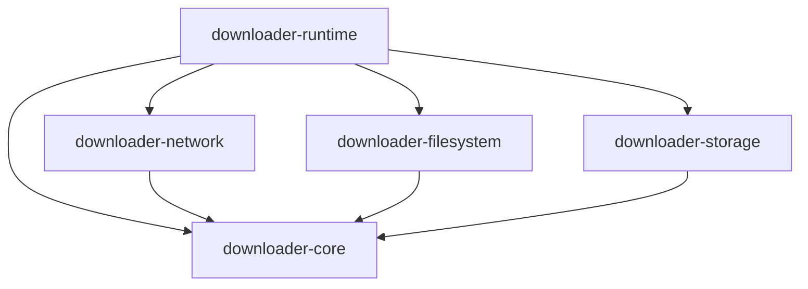
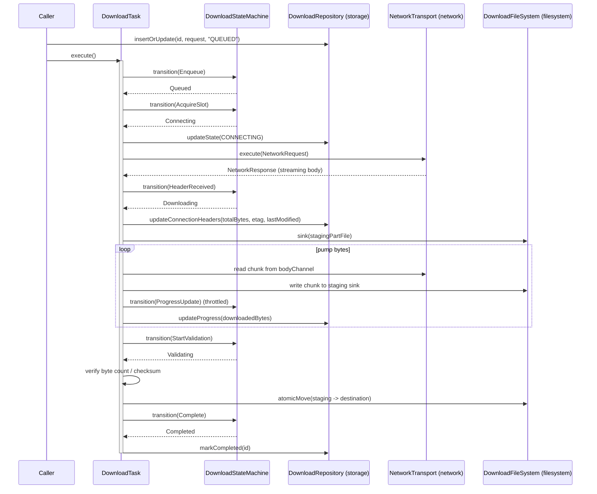
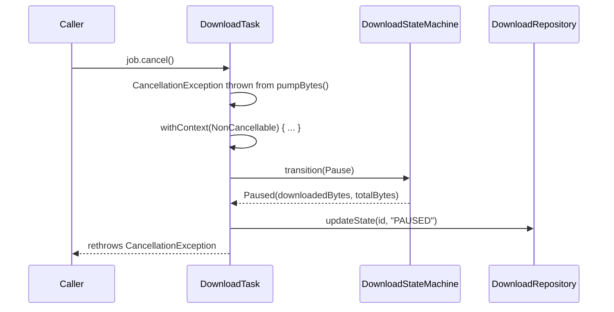
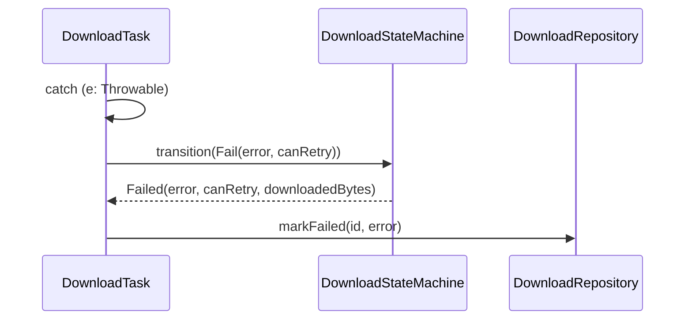

# Architecture Overview

This document ties together all the modules in `kmp-file-downloader` — what each one owns, how
they depend on each other, and the end-to-end flow of a single download. It's the starting point
for understanding the codebase; module-specific docs go deeper on individual pieces:

- [`downloader-network` module](../networking/downloader-network-module.md)
- [`DownloadStateMachine` tests](../testing/download-state-machine.md)
- [`DownloadTask` engine](../engine/download-task.md)
- [`downloader-runtime` module](../runtime/downloader-runtime-module.md)

## Module map

```
kmp-file-downloader
├── downloader-core         (domain models, state machine, DownloadTask engine, interfaces)
├── downloader-network      (Ktor-based NetworkTransport implementation)
├── downloader-filesystem   (Okio-based DownloadFileSystem implementation)
├── downloader-storage      (SQLDelight-based DownloadRepository implementation)
└── downloader-runtime      (multiplatform integration tests wiring core+network+filesystem+storage)
```

### Dependency direction



`downloader-core` is the innermost layer — it has **no** dependency on network, filesystem, or
storage. It only defines:

- **Domain models**: `DownloadRequest`, `DownloadRecord`, `DownloadState`, `DownloadError`,
  `DownloadId`, `DownloadPriority`, `ConflictStrategy`, `ChecksumValidation`,
  `NetworkRequest`/`NetworkResponse`.
- **Interfaces (ports)**: `DownloadRepository`, `DownloadFileSystem`, `NetworkTransport` — each
  implemented by a dedicated module (`downloader-storage`, `downloader-filesystem`,
  `downloader-network` respectively). This is a ports-and-adapters (hexagonal) design: the engine
  only ever talks to interfaces, never to Ktor/Okio/SQLDelight directly.
- **The state machine**: `DownloadStateMachine` / `DownloadStateEvent` — a pure, dependency-free
  state container.
- **The engine**: `DownloadTask` — orchestrates a single download's lifecycle by driving the state
  machine and calling the three interfaces above. See
  [`docs/engine/download-task.md`](../engine/download-task.md) for a deep dive.

`downloader-network`, `downloader-filesystem`, and `downloader-storage` are adapters: each
depends on `downloader-core` (to implement its interfaces / use its models) but not on each
other, and `downloader-core` never depends on them — keeping the dependency graph acyclic and
each adapter independently testable/swappable.

`downloader-runtime` sits on top of all four and previously existed as three near-empty,
platform-specific shells (`downloader-runtime-android`, `downloader-runtime-desktop`,
`downloader-runtime-ios`). They have been consolidated into a single `downloader-runtime` module.
See [`docs/runtime/downloader-runtime-module.md`](../runtime/downloader-runtime-module.md) for
details on that consolidation.

## End-to-end flow of a single download



### Cancellation / pause path

If the caller cancels the coroutine running `execute()` (e.g. user pauses the download) mid
stream, `DownloadTask` catches `CancellationException` and performs cleanup **inside a
`NonCancellable` context** — this is important, see
[Cancellation and `NonCancellable` cleanup](../engine/download-task.md#cancellation-and-noncancellable-cleanup):



### Failure path

Any other exception (`DownloadError` or unexpected `Throwable`) is caught, wrapped as a
`DownloadError` if necessary, and drives a `Fail` transition instead:



## State machine reference

The full state diagram and transition table are documented in
[`docs/testing/download-state-machine.md`](../testing/download-state-machine.md). The key rule
that `DownloadTask` must respect (and previously violated — see the engine doc) is that every
lifecycle **must start with `Enqueue` (`Idle -> Queued`) before `AcquireSlot` (`Queued ->
Connecting`)** — states cannot be skipped.

## Testing strategy across modules

| Module               | What's tested                                                                                                                                                               | Where                                |
|----------------------|-----------------------------------------------------------------------------------------------------------------------------------------------------------------------------|--------------------------------------|
| `downloader-core`    | `DownloadStateMachine` transition rules (pure, no I/O)                                                                                                                      | `downloader-core/src/commonTest`     |
| `downloader-network` | HTTP request/response mapping via `MockEngine` (no real network)                                                                                                            | `downloader-network/src/commonTest`  |
| `downloader-storage` | SQLDelight queries against an in-memory SQLite DB                                                                                                                           | `downloader-storage/src/desktopTest` |
| `downloader-runtime` | Full `DownloadTask` integration: real state machine + real repository (in-memory SQLite) + fake filesystem (`okio.fakefilesystem.FakeFileSystem`) + fake `NetworkTransport` | `downloader-runtime/src/desktopTest` |

`downloader-runtime`'s tests are the only ones that exercise the complete, wired-together engine
end-to-end (minus real network/disk I/O, which are faked), which is why `DownloadTaskTest` lives
there instead of in `downloader-core` — it depends on concrete implementations from all three
adapter modules.
